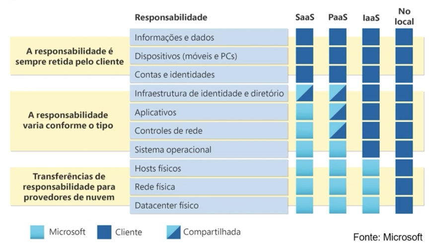

# microsoft-azure_lab-resume
This repository contains the brief notes of what was leaned at DIO development lab.

## Initial Instructions

- Create Microsoft Azure Account;
- Sign up for a free signature;
- Intro tour in the web platform.

## IaaS, Paas e SaaS na Azure

- Infrastructure as a Service:
    - Resources more accessible to users (setup, updates, general customization);
    - More flexibility.
- Platform as a Service:
    - Only the necessary environment to run applications;
    - Focus on applications development;
    - Platform managed by provider.
- Software as a Service
    - Existing applications.
    - Users pay for what they use.
 

## Shared Responsability Model

## Azure Architecture Components

- Regions:
    - Possibility to choose where to create resources;
    - There are price and availability differences between regions;
    - Regions are composed of a group of datacenters.
- Availability Zones:
    - Inactivity and datacenter failure protection;
    - Datacenter’s hardware separated in the region;
    - Each datacenter has its own resources, like energy and network;
    - They are connected with optical fiber wires.
- Region Pairs:
    - At least 300 miles between regions;
    - Automatic replication for some services;
    - Region recovery prioritized in case of interruption;
    - Every region has its pair.
- Azure Sovereign Regions:
    - Exclusive for USA governmental services:
        - Physically isolated and only accessible for authorized personnel.
    - Exclusive for China:
        - Also isolated and operated by 21Vianet;
        - All data remain inside China for conformity.
- Azure Resources:
    - Virtual Machines, Storage, Virtual Networks, Application Services, SQL Databases, Functions;
    - Resources Groups:
        - A container to manage resources as a unit;
        - Resources can only exist in one group;
        - Resources can exist in different regions;
        - Can be moved to other groups;
        - Applications can use several groups.
- Azure Subscriptions:
    - An account can contain many subscriptions, but a subscription can only be associated to one account.
    - For Azure accounts authentication and authorization;
    - For billing categorization;
    - Management Groups:
        - Can include many subscriptions;
        - Allow hierarchy policies control.

## Building Architectures in Azure

- Explore Azure datacenters around the world;
- Azure Regions:
    - Data residency;
    - Data replication;
- Resource Groups:
    - Choose region;
    - Activity Log;
    - IAM (access control);
    - Tags;
    - Resources Viewer;
    - Events;
    - Prices;
    - Metrics.
- Virtual Network:
    - Automation template;

## Setting up Azure Virtual Machine Resources and Customizations

- Create Customized Virtual Machine:
    - Choose region;
    - Create availability set;
    - Azure Spot discount;
    - Select VM Size (processing power, memory, and storage capacity);
    - It’s also possible to choose a predefined setup for some known solutions;
    - Choose which ports will be open;
    - Set disks to be excluded with VM;
    - Possibility to select the same disk in many VMs;
    - Create a virtual network;
    - Set public IP and NIC to be excluded with VM;
    - Set auto-shutdown, backup, SO updates;
    - Set monitoring tools for alerts, diagnostics and integrity;
    - Add extensions;
    - Add tags;
    - Check price and confirm creation.
- Azure Virtual Desktop:
    - Create Host;
    - Validation Environment;
    - Session type: Personal or Pool;
    - Load Balancing;
    - Session limit.
- Function App:
    - Set code or container image;
    - Runtime stack;
- Region and OS.

##  Storage Accounts

- Registration:
    - Name must be unique in the platform;
    - It must be 3 to 24 characters long, and can contain only lowercase letters and numbers;
- Performance:
    - Standard: general usage;
    - Premium: lower latency.

 ### Storage Redundancy
- LRS (locally-redundant storage):
    - Lower-cost with basic protection against server rack and drive failures;
    - Recommended for non-critical scenarios;
    - 3 copies on the same datacenter at primary region;
    - Durability: 11 nines.
- GRS (geo-redundant storage):
    - Intermediate option with failover capabilitier in a secondary region;
    - Recommended for backup scenarios;
    - 1 datacenter at primary region, and 1 copy in a secondary region;
    - Durability: 12 nines.
- ZRS (zore-redundant storate):
    - Intermediate option with protection against datacenter-level failures;
    - Recommended for hight availability scenarios;
    - 3 copies at primary region, each in a different datacenter;
    - Durability: 16 nines.
- GZRS (geo-zone-redundant storage):
    - Optimal data protection solution that includes the offerings of both GRS and ZRS;
    - Recommended for critical data scenarios;
    - ZRS strategy at origin and GRS at destination;
    - 3 availability zones at primary region, and 1 datacenter at secondary region;
    - Durability: 16 nines.

### Azure Storage Services
- Public Endpoint:
    - https://<storage-account-name>.<resource-type>.core.windows.net
- Access Tiers:
    - Frequent: optimized for files frequently accessed;
    - Sporadic: optimized for lower frequency access, and up to 30 days;
    - Cold: optimized for few accessed files, and at least 90 days;
    - Deep Archive: optimized for rarely accessed files, and at least 180 days.

### Migrations

- Azure Data Box:
    - Data Box Disk: up to 8TB;
    - Data Box: up to 80TB;
    - Heavy Data Box: up to 800TB.
- AzCopy:
    - Command Prompt;
    - To copy blobs or files to or from a storage account;
    - One direction sync.
- Storage Management:
    - Graphical Interface (similar to Windows Explorer);
    - Compatible with Windows, MacOS and Linux;
    - Bi direction sync;
    - With cache protocols

## Identity, Access, and Security

### Microsoft Entra ID
- Authentication;
- SSO (Single Sign On);
- Apps manager;
- Microsoft Entra External ID:
    - B2C (Business to Customer):
        - Published app customers.
    - B2B (Business to Business)
        - For partners, providers, other colaborators.
- Devices management;
- MFA (Multi-Factorial authentication)
    - Something you know;
    - Something you own;
    - Something you are.

### Conditional Access
- User/Group association;
- Local IP address;
- Device;
- App;
- Risk detection.

### Function Based Acesss Control
- Fine granularity access management:
    - RBAC (Role Based Access Control).
- Give only relevant privileges to specific teams;
- Enable the access to Azure portal and Resources Access Control:
    - Authorizations are inheritable.
- Zero trust
- Full protection
    - Local access, identity and access, perimeter, network, computing, application, data.
- Microsoft Defender for Cloud:
    - Security recomendations;
    - Malware detect/block;
    - Analise and identify potential attacks;
    - Just-in-time port control.

## Cost Management

### Factors that affect costs:
- Resource type;
- Consumption:
    - Pay As You Go;
    - Reserved.
- Maintenance;
- Geographic localization;
- Network traffic;
- Subscription.

### Azure Marketplace
- Freeware container platforms;
- VM and DB images;
- Compilation softwares and apps deployment;
- Developer tools;
- More than 10k items;
- Assistance with third party software is not provided by Microsoft!

### Estimated Price Calculator
- Options available:
    - Region;
    - Tier;
    - Billing;
    - Support;
    - Agreements;
    - Development/Trial;
- TCO (Total Cost Ownership):
    - Tool to estimate the economy for the migration to Azure;
    - Compares local structure spendings with Azure's cloud products and services prices;
- Azure Expenses Management
    - Billing reports;
    - Define budget;
    - Limit alert;
    - Recommendations;

### Tags
- Azure resources optional metadata (pair name:value);
- Usefull for billing organization;

## Governance and Compliance

### Azure Policy
- Imposes rules;
- Verifies and identifies Azure resources that do not comply with policies;
- Gives policy definitions and integrated initiatives, categorized.

### Resources lock
- Protects Azure resources from accidental exclusion or modification;
- Manages locks in subscriptions, resources groups, or individual resource tiers.

### Service Trust Portal
- How Microsoft cloud services protect clients data, and how clients can manage cloud data security and compliance for their organization.

### Microsoft Pureview
- Management of governance, risk and compliance;
- Insights about local data, multicloud, and SAS;
- Automated data discovery;
- Classified data classification;
- Full data overview;

## Management and Deployment Tools

### Tools to interact with Azure
- Azure Portal;
- Azure Cloud Shell:
    - Azure PowerShell;
    - CLI (Command Line Interface).

### Azure Arc
- Manage external resources (on premises, other providers) from Azure.

### ARM (Azure Resource Manager)
- A layer available to manage Azure subscription resources.
- ARM Models:
    - Resource Manager Model;
    - No model code Infrastructure.
- Bicep.

# Monitoring Tools

## Azure Assistant

- Trust, Security, Performance, Cust, Operational Excellence.

## Azure Service Integrity

A collection of services to monitor Azure's general status;
- Focused on only used regions;
- Resource Health: Individual analysis for resources.

## Azure Monitor

- Focused on availability and performance;
- Collects, analysis and works with local and cloud environment data;
- Logs analitics;
- Application insights.
